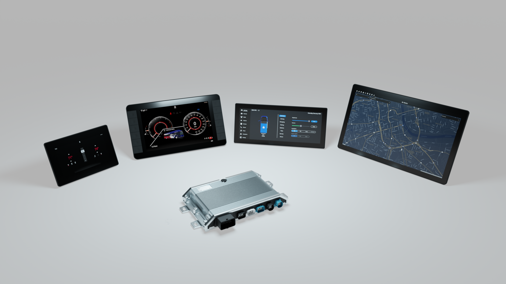

### Product Details

NeuralPlex is a central compute ECU that integrates system control and consolidates major cockpit related features into a single ECU. In-Vehicle Infotainment, telematics, audio, gauge cluster, vision, connectivity (Ethernet, WiFi, Bluetooth, Cellular, GPS), multiple displays with support for phone projection (Android Auto, Apple CarPlay).

### Reference App
To facilitate development, MRS-Electronic developed a Reference Application written in Qt/QML. This application shows how to use different NeuralPlex interfaces for custom applications.

This document refers to the Reference App to better understand the system's components, interactions, and customization abilities.

### Intended Users
These instructions address trained experts familiar with the software's programming and technical understanding. Due to their expert training, knowledge, experience, and knowledge of the relevant standards and regulations, trained experts can assess the tasks assigned to them and recognize possible dangers.

### Validity
These instructions become valid when the product is transferred from MRS Electronic to the customer. Changes to these operating instructions are possible at any time and without the specification of any reason. The current version of this document replaces all previous versions of user manuals ever released.

### Copyright Information
This manual, in its entirety, is copyrighted to © MRS Electronic, Inc. and protected by international copyright laws. All rights are reserved. No part of this manual may be reproduced in any form without the written permission of MRS Electronic, Inc. All trademarks are the property of their respective owners.

MRS Electronic, Inc. has compiled this document with the utmost diligence while keeping the current state of technology in mind. However, MRS Electronic, Inc. will not assume any liability or responsibility for any errors in content, form, or missing updates that result in damages or drawbacks.

### Technical Support
This section provides you information related to technical support from the manufacturer.

|  |  |
| ------- | ------- |
| Manufacturer Name | MRS Electronic, Inc. |
| Address | 6680 Poe Ave., Suite 100, Dayton, OH 45414, USA |
| Phone | +1.937.522.0800 |
| Website | https://mrs-electronics.com |
| Email | info@mrs-electronics.com |

### Warranty Conditions
See the General Terms and Conditions of MRS Electronic, Inc. at [www.mrs-electronics.com/terms-of-use](https://www.mrs-electronics.com/terms-of-use).