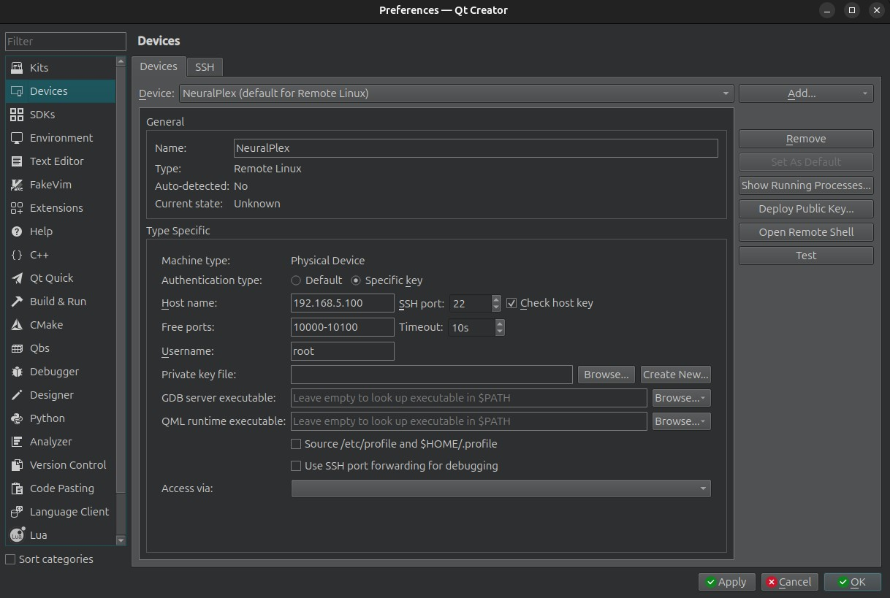
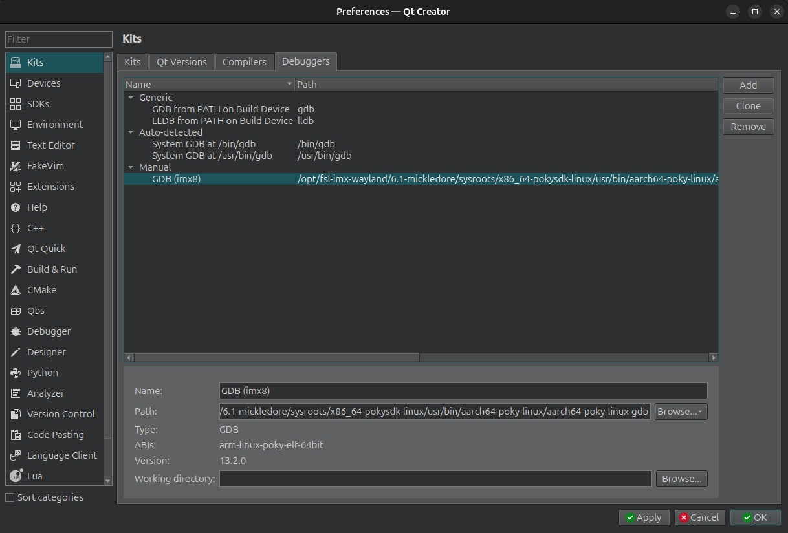
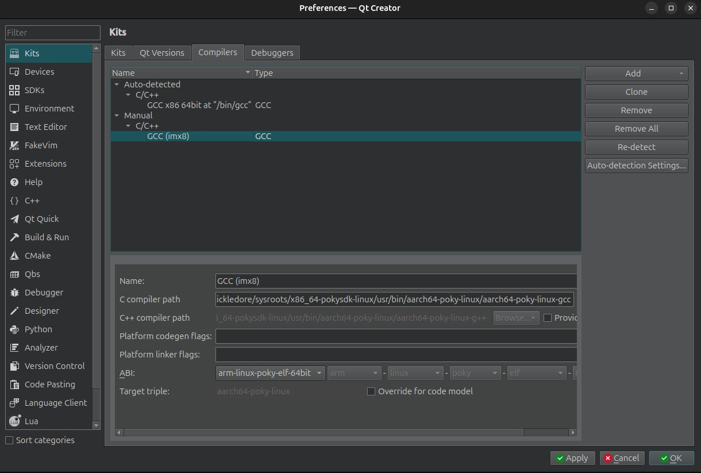
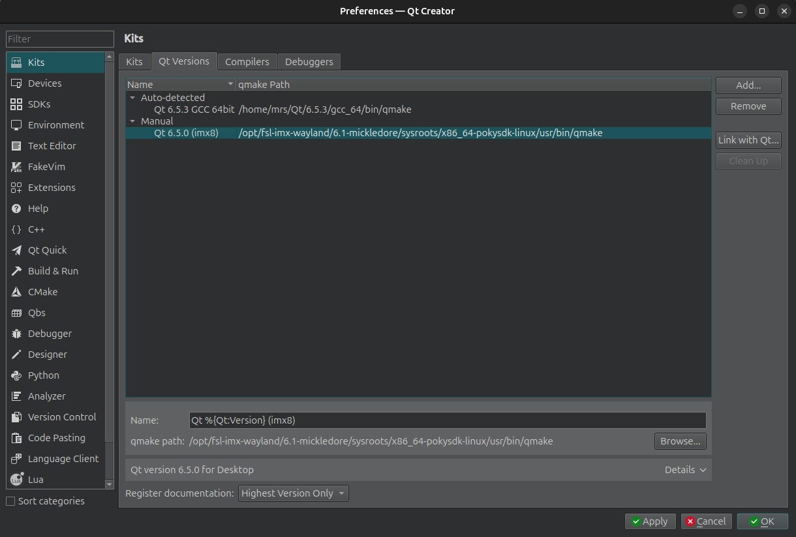
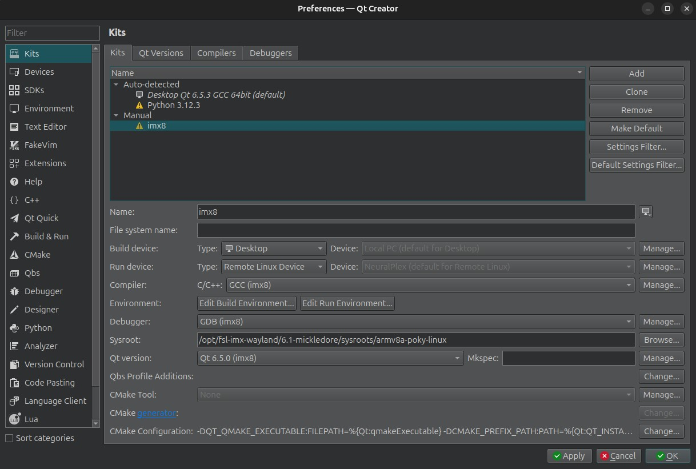

import { Aside, Steps } from '@astrojs/starlight/components';

This section covers the details of setting up your development environment. You can set it up yourself or get a pre-configured virtual machine, from MRS Electronic.

<Aside>
The document solely focuses on the development on Linux host. However, it can be setup on Windows host as well. For more details, contact MRS Electronic.
There are multiple virtualization techniques, but the document focuses on setting up an Ubuntu development environment using VirtualBox.
</Aside>

Download the latest version of [VirtualBox](https://www.virtualbox.org/wiki/Downloads) according to your device’s architecture.

### Pre-Configured Machine
If you are using a pre-configured virtual machine from MRS, you can simply install it and jump to the Setting Up NeuralPlex section. The virtual machine is already setup for the development and cross-compiling.

### Manual Configuration
To configure your machine manually, the following requirements must be fulfilled:

#### System Requirements
| Component        | Requirement  |
| :--------------- | :------- |
| Operating System | Modern Linux distribution (Ubuntu 2024.04, Fedora, Debian, CentOS)    |
| Processor        | Quad-Core      |
| Memory           | 8GB of RAM |
| Disk Space       | 50 GB of free disk space    |

#### Software Requirements
| Software              | Ubuntu 2024.04  |
| :-------------------- | :------- |
| Build Essential Tools | build-essential |
| Qt 6.8.1 Dependencies | libxcb1 libxcb1-dev libxcb-keysyms1-dev libxcb-image0 libxcb-image0-dev |
| Development Libraries | libgl1-mesa-dev libglu1-mesa-dev libxrender-dev libfontconfig1-dev |
| Other Useful Tools    | pkg-config git cmake |

<Aside type="tip">
Depending on your deployment strategy, you can either purchase Qt Commercial or begin development using the Open-source version of Qt, which is free. Consult your lawyers regarding the suitable version for your application.
</Aside>

<Aside>
To attain the steps to set up a cross-compile toolchain for Qt to allow the deployment of application to the Display, contact MRS Electronic.
</Aside>

### Required Permissions
You require admin privileges to perform the steps of installation.

### Installation Steps
The steps of installation are as follows:

<Steps>
1. Install the latest version of Ubuntu.
2. Setup Qt development environment by downloading the [latest version of Qt](https://www.qt.io/download). At the time of writing this document, the NeuralPlex has Qt 6.8.x installed. Navigate to [this link](https://www.youtube.com/watch?v=Y1jS9U1BiC0) to find the steps to install Qt6 in Ubuntu.
3. Run the installer to begin the installation process.
4. Open Qt Creator
5. In Qt Creator, go to Edit -> Preferences
6. Select the `Devices` item
    
7. Click "Add" -> "Remote Linux Device" and give it the name `NeuralPlex`.
    - In the `Host Name` field, enter `192.168.5.100`
    - In the `Username` field, enter `root`
    - Make sure the USB cable (gray connector) is connected from the NeuralPlex to the development machine.  Your development machine should have a `usb0` interface and have a static IP address of `192.168.5.101`, netmask of `255.255.255.0`, and gateway set to `192.168.5.100`.
    - Click "Test" and confirm that your development machine is able to connect to the NeuralPlex
8. Select the `Kits` item
9. Click on the `Debuggers` tab
    
10. Click "Add" and give it the name `GDB (imx8)`.  The debugger path is: `/opt/fsl-imx-wayland/6.1-mickledore/sysroots/x86_64-pokysdk-linux/usr/bin/aarch64-poky-linux/aarch64-poky-linux-gdb`
11. Click on the `Compilers` tab
    
12. Add a GCC compiler and give it the name `GCC (imx8)`.  The compiler path is: `/opt/fsl-imx-wayland/6.1-mickledore/sysroots/x86_64-pokysdk-linux/usr/bin/aarch64-poky-linux/aarch64-poky-linux-gcc`
13. Click on the `Qt Versions` tab
    
14. Click "Add" and give it the name `Qt %{Qt:Version} (imx8)`.  The qmake path is: `/opt/fsl-imx-wayland/6.1-mickledore/sysroots/x86_64-pokysdk-linux/usr/bin/qmake`
15. Click on the Kits tab
    
16. Click "Add" and then in the name field, enter the name: imx8.
    - In the Compiler C/C++ dropdown, select `GCC (imx8)`
    - In the Debugger dropdown, select `GDB (imx8)`
    - In the Qt version dropdown, select `Qt 6.8.1 (imx8)`
17. Click "Apply".  You can now cross compile your software and run it on the display
</Steps>