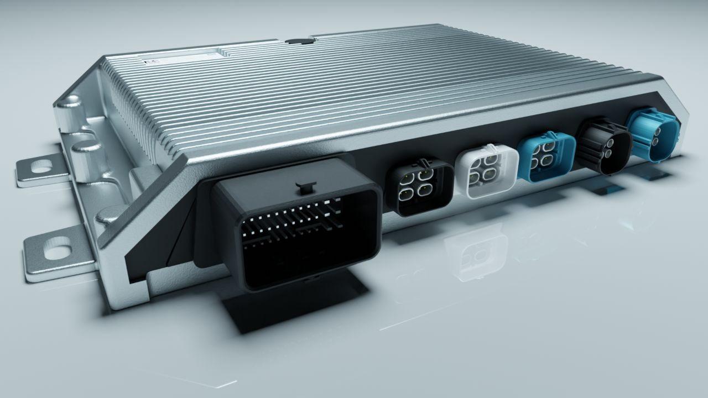
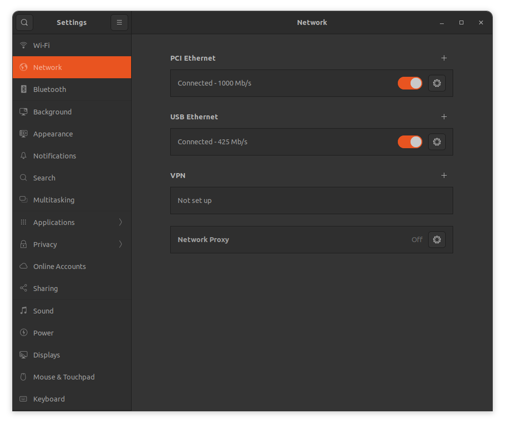
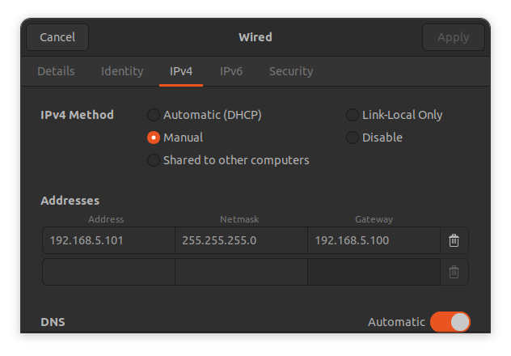

import { Aside, Steps } from '@astrojs/starlight/components';

This section covers the details of some components that help you in get started with the NeuralPlex.

### Main Connector
The NeuralPlex main connector a `Molex 5007620481`, for power, ground, CAN, I/O, etc.  The mating connector is `Molex 643203311`.  The pinout is shown in the table below:

| Pin | Function  | Pin | Function    | Pin | Function      | Pin | Function      |
| --- | --------- | --- | ----------- | --- | ------------- | --- | ------------- |
| A1  | PWM_3     | B1  | PWM_4       | C1  | LINE_OUT3_L   | D1  | LINE_OUT2_L   |
| A2  | PWM_2     | B2  | LINE_OUT3_R | C2  | LINE_OUT3_GND | D2  | LINE_OUT2_GND |
| A3  | PWM_1     | B3  | ANA_IN_2    | C3  | ANA_IN_3      | D3  | KL15          |
| A4  | CAN0_L    | B4  | CAN0_H      | C4  | CAN1_L        | D4  | CAN1_H        |

| Pin | Function    | Pin | Function    | Pin | Function      | Pin | Function      |
| --- | ----------- | --- | ----------- | --- | ------------- | --- | ------------- |
| E1  | GND         | F1  | GND         | G1  | MIC_IN_3      | H1  | MIC_IN_4      |
| E2  | LINE_OUT2_R | F2  | LINE_OUT1_R | G2  | LINE_OUT1_L   | H2  | LINE_OUT1_GND |
| E3  | ANA_IN_1    | F3  | ANA_IN_4    | G3  | N/C           | H3  | N/C           |
| E4  | CAN3_L      | F4  | CAN3_H      | G4  | CAN2_L        | H4  | CAN2_H        |

| Pin | Function    | Pin | Function      | Pin | Function      | Pin | Function       |
| --- | ----------- | --- | ------------- | --- | ------------- | --- | -------------- |
| J1  | N/C         | K1  | VREF_OUT      | L1  | KL30          | M1  | KL30           |
| J2  | MIC_IN_1    | K2  | MIC_IN_2      | L2  | GND           | M2  | SPK_R_OUT+     |
| J3  | RS232_RXD   | K3  | LIN           | L3  | GND           | M3  | SPK_R_OUT-     |
| J4  | RS232_TXD   | K4  | SPK_L_OUT+    | L4  | SPK_L_OUT-    | M4  | POWER_AMP      |



At a minimum, to run the reference application, you will need to connect `KL30`, `KL15`, `GND`, `CAN0_L`, and `CAN0_H`.

### Power Supply
To power up the NeuralPlex, you must ensure your mating connector has the proper connections. Make the connection in the following manner:

- Connect pins `L1`, `M1`, `D3` to +9-32V VCC
- Connect pins `E1`, `F1`, `L2`, `L3` to GND

NeuralPlex will draw up to 2A @ 12V, depending on tasks and CPU usage.  Typical usage is about 1.25A, so please ensure that the power supply is capable of supplying at least 2A. 

### Connection to NeuralPlex
The NeuralPlex can be accessed through ssh from multiple interfaces.

- **Ethernet-over-USB (preferred)**
- Ethernet (Available only if ordered)
- WiFi (Available only if ordered)

#### Ethernet-over-USB (preferred)
To connect via USB, simply connect to the USB 2.0 connector on the back of the NeuralPlex (gray connector) and plug into your development machine.  By default, the NeuralPlex USB interface is configured with the `g_ether` module and is set with a static IP address of `10.10.5.1`.  Your development machine should have a `usb0` interface and you will need to manually configure your development machine to have a static IP address of `10.10.5.100`, netmask of `255.255.255.0`, and gateway set to `10.10.5.1`.  Once configured, you can now access the device through SSH as follows:

```bash title="Connect to NeuralPlex"
root@neuralplex:~# ssh root@10.10.5.1
```




#### Ethernet Connection
To connect via Ethernet, simply connect to the 1000BASE-TX connector on the front of the NeuralPlex and plug into your development machine. By default, the NeuralPlex ethernet interface is configured as a DHCP client, so you will need to run `eth-conf.sh -s` to configure NeuralPlex as a DHCP server, so that it will automatically assign the IP address to the connected device. You can now access the device through SSH as follows:

```bash title="Connect to NeuralPlex"
root@neuralplex:~# ssh root@10.10.4.1
```

#### Wi-Fi Connection
By default, the NeuralPlex operates like an Access Point. To connect via Wi-Fi, follow the steps below:

1. Search for a network with SSID: `NeuralPlex-xxx`. The last section of the name will be unique string for each device.
2. Connect to the network using password: `12345678`.
3. You can now access the device through SSH as follows:

```bash title="Connect to NeuralPlex"
root@neuralplex:~# ssh root@10.10.3.1
```

### SSH/SCP Connection
The connection to Display via SSH/SCP is required to access the terminal or perform actions like sharing files. The details of that are shown in the table below:

| Field                            | Value     |
| -------------------------------- | --------- |
| IP Address (USB Connection)      | 10.10.5.1 |
| IP Address (Ethernet Connection) | 10.10.4.1 |
| IP Address (Wi-Fi Connection)    | 10.10.3.1 |
| Port                             | 22        |
| Username                         | root      |
| Password                         | mrsroot   |

### File System
The root file system operates in read-only mode as it is safer and faster. However, for actions like copying the user application or enabling a systemd service, the read/write mode is required. To switch to that mode, follow these steps:

<Steps>
1. Type the following terminal command:
    ```bash title="Mount drive as read/write"
    root@neuralplex:~# mount -o remount,rw /
    ```
2. After writing, issue the sync command to complete the process of writing to the main file and switch back to the read-only mode.
    ```bash title="Mount drive as read-only"
    root@neuralplex:~# sync
    root@neuralplex:~# mount -o remount,ro /
    ```
</Steps>

### Read/Write Partition
The root file system operates in read-only mode. However, there is a dedicated partition for user data and operates in read/write mode. This partition also contains some important configuration files that you can change.

To navigate to this location, enter the following commands:

```bash title="Read/Write partition"
root@neuralplex:~# cd /rw_data
```

<Aside type="tip">
After writing files to the read/write partition, ensure to issue the **sync** command to complete the process of writing to the partition.
</Aside>