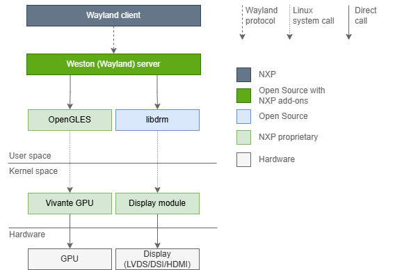

Weston is the reference implementation of a Wayland compositor, as well as a useful environment in and of itself.

Weston provides a very basic desktop, or a full-featured environment for non-desktop uses such as automotive and embedded. It also provides a library allowing other projects to build their own full-featured environments on top of Weston’s core.



### Configuration
You can configure the the weston shell’s look and behavior preferences through `/etc/xdg/weston/weston.ini` file.

Please refer to [Ubuntu weston.ini manpage](http://manpages.ubuntu.com/manpages/jammy/en/man5/weston.ini.5.html) to know more about how to configure it.

### Multiple Display Heads
Weston supports multiple display heads with multiple overlays on NeuralPlex. Use weston.ini to set the expected resolution and orientation of the external displays.

If multiple displays are connected, applications are launched on the one that contains the mouse pointer at the time of launch. Once an application is launched, you can drag it across a boundary between displays.

If multiple displays are connected and they have different resolutions, Weston reports the frame rate of the display on which more than 50% of its window is displayed.

If a monitor is removed while Weston is running (hot removal), running applications dynamically shift to the remaining active monitor.

### Example of weston.ini Display Options
Use this example as a model for setting your own display options in `weston.ini`.  Setting `mode=preferred` uses the default resolution set by the device tree.

To specify which display head you want your app to run on, use `app-ids` to specify the name(s) of the application.  If you want multiple instances of the same application to run on each of the heads, you must create a copy of your application and name them accordingly.  Then, specifying the name of the application in the `app-ids` will determine at runtime which head to display the app on.

```bash title="weston.ini"
[core]
shell=kiosk-shell.so

[output]
name=LVDS-1
mode=preferred
app-ids=com.mrs-electronics.neuralplex-demo-1

[output]
name=LVDS-2
mode=preferred
app-ids=com.mrs-electronics.neuralplex-demo-2

[output]
name=DSI-1
mode=preferred
app-ids=com.mrs-electronics.neuralplex-demo-3

[output]
name=DSI-2
mode=preferred
app-ids=com.mrs-electronics.neuralplex-demo-4
```

#### Get app-id of application
To determine the app-id of your application, you can enable debugging to view the app-id.
```bash title="Check app-id"
root@neuralplex:~# WAYLAND_DEBUG=1 neuralplex-demo 2>&1 | grep set_app_id

# Result:
[3645913.156]  -> xdg_toplevel@28.set_app_id("com.mrs-electronics.neuralplex-demo-3")
```

### Qt Environment Variables
When deploying a Qt app from Qt Creator, you need set the following environment variables:
```bash title="Qt Environment Variables"
WAYLAND_DISPLAY=/run/wayland-0
XDG_RUNTIME_DIR=/run/user/0
```