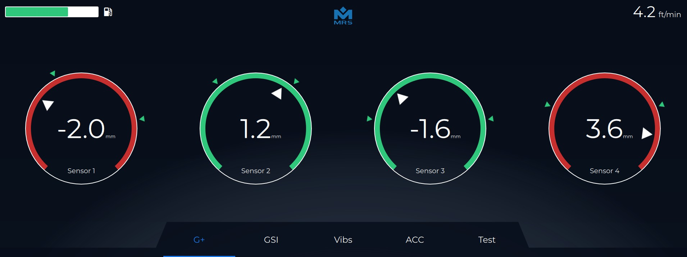

import { Code, Tabs, TabItem } from '@astrojs/starlight/components';
import main_cpp from '../../code/main.cpp?raw';
import vehicle_hpp from '../../code/Vehicle.hpp?raw';
import vehicle_cpp from '../../code/Vehicle.cpp?raw';
import canbus_hpp from '../../code/CanBus.hpp?raw';
import canbus_cpp from '../../code/CanBus.cpp?raw';
import main_qml from '../../code/Main.qml?raw';

The reference application project provides developers with example source code of how to program with Qt and display live data from the CAN bus on the screen.  Contained in the MRS Virtual Machine is a CAN simulation application that allows you to adjust sliders which cause the reference app gauges to update to the simulated CAN messages.

### Reference App Code

<Tabs>
  <TabItem label="main.cpp">
    <Code code={main_cpp} lang="cpp" />
  </TabItem>
  <TabItem label="Vehicle.hpp">
    <Code code={vehicle_hpp} lang="cpp" />
  </TabItem>
  <TabItem label="Vehicle.cpp">
    <Code code={vehicle_cpp} lang="cpp" />
  </TabItem>
  <TabItem label="CanBus.hpp">
    <Code code={canbus_hpp} lang="cpp" />
  </TabItem>
  <TabItem label="CanBus.cpp">
    <Code code={canbus_cpp} lang="cpp" />
  </TabItem>
  <TabItem label="Main.qml">
    <Code code={main_qml} lang="qml" />
  </TabItem>
</Tabs>