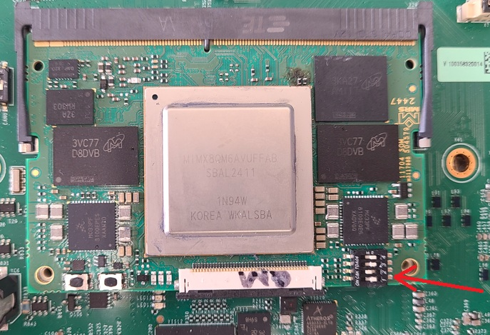
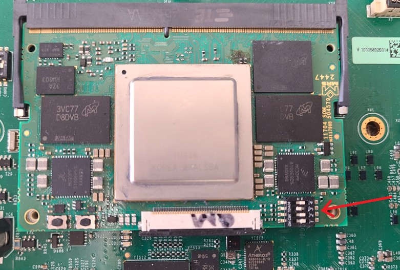

import { Aside, Steps } from '@astrojs/starlight/components';

### Tools/Software Needed:
1. JLink Plus Segger 8.08.28
2. FS5600 FREEDOM board
3. PF5020 FREEDOM board
4. NXP GUI Software
5. NXP S32DS v3.5 Software

### Flash YIS2 (FS5600)
<Steps>
1. Connect 3.3V from the FREEDOM board to X32.1.  This supplies 3.3V to the mainboard to allow YIS2 to be flashed.
2. Connect I2C from FREEDOM board to X27 and GND to X32.2.
3. Apply 12V to KL30 and IGN pins
4. Open NXP GUI software, select FS5600.  Press `Start`.  Press and hold SW3 and then select `Test Mode` and press `Apply`.  Continue to hold SW3 until the PMIC has been programmed.
5. Once the PMIC has successfuly entered `Test Mode`, select the `Prog` menu on the left side and press the `Browse` button to select a config script.  The config script can be found here:
    - Q:\Projects\11704_NeuralPlex\Rev_C\060_SW\YIS2_3.3V_FS5600_BA0_OTP_Rev_A_22MHz_450KHz_FSS.txt
6. Now that the script is selected, continue to hold SW3 and then press `Program`
7. After PMIC has been programmed, depress SW3, disconnect KL30 and IGN pins, and disconnect 3.3V
8. Power on KL30 and IGN and PMIC should now be programmed.  Verify by measureing the voltage outputs on the PMIC.
</Steps>

### Flash S32K
<Steps>
1. Before flashing the S32K, R164 must be depopulated on the mainboard.
2. Connect the JLink Plus Segger to the JTAG header (X1) on the mainboard.
3. Apply 12V to KL30 and IGN pins
4. Open NXP S32DS.3.5 Software and flash S32K
</Steps>

### Flash YIS17 (PF5020)
<Steps>
1. Connect I2C from FREEDOM board to X27 and GND to X32.2
2. Apply 12V to KL30 and IGN pins
3. Open NXP GUI software, select PF5020.  Press `Start`, and then select `Test Mode` and press `Apply`.
4. Once the PMIC has successfuly entered `Test Mode`, select the `Prog` menu on the left side and press the `Browse` button to select a config script.  The config script can be found here:
    - Q:\Projects\11704_NeuralPlex\Rev_C\060_SW\YIS4_YIS17_PF5020_ASILB_BA0_OTP_ SW1=1.8V SW2=1.1V SWND=3.3V ILIM=2.6A LDO=3.3V.txt
5. Now that the script is selected, press and hold SW4 and then press `Program`
6. After PMIC has been programmed, depress SW4, disconnect KL30 and IGN pins.
7. Power on KL30 and IGN and PMIC should now be programmed.  Verify by measureing the voltage outputs on the PMIC.
</Steps>

### Flash YIS3 (FS5600)
<Steps>
1. Connect I2C from FREEDOM board to X28 and GND to X32.2
2. Apply 12V to KL30 and IGN pins
3. Open NXP GUI software, select FS5600.  Press and hold SW5 and then select `Test Mode` and press `Apply`.  Continue to hold SW5 until the PMIC has been programmed.
4. Once the PMIC has successfuly entered `Test Mode`, select the `Prog` menu on the left side and press the `Browse` button to select a config script.  The config script can be found here:
    - Q:\Projects\11704_NeuralPlex\Rev_C\060_SW\YIS3_FS5600_BA0_OTP_Rev_A_22MHz_450KHz_FSS.txt
5. Now that the script is selected, continue to hold SW5 and then press `Program`
6. After PMIC has been programmed, depress SW5, disconnect KL30 and IGN pins.
7. Power on KL30 and IGN and PMIC should now be programmed.  Verify by measureing the voltage outputs on the PMIC.
</Steps>

### Flash YIS4 (PF5020)
<Steps>
1. Connect I2C from FREEDOM board to X27 and GND to X32.2
2. Apply 12V to KL30 and IGN pins
3. Open NXP GUI software, select PF5020.  Press `Start`, and then select `Test Mode` and press `Apply`.
4. Once the PMIC has successfuly entered `Test Mode`, select the `Prog` menu on the left side and press the `Browse` button to select a config script.  The config script can be found here:
    - Q:\Projects\11704_NeuralPlex\Rev_C\060_SW\YIS4_YIS17_PF5020_ASILB_BA0_OTP_ SW1=1.8V SW2=1.1V SWND=3.3V ILIM=2.6A LDO=3.3V.txt
5. Now that the script is selected, press and hold SW6 and then press `Program`
6. After PMIC has been programmed, depress SW6, disconnect KL30 and IGN pins.
7. Power on KL30 and IGN and PMIC should now be programmed.  Verify by measureing the voltage outputs on the PMIC.
</Steps>

### Flash YIS12 (SJA1110)
<Steps>
1. Apply 12V to KL30 and IGN pins
2. Connect the Lauterbach debugger to the JTAG header (X4) on the mainboard.
2. Open NXP S32DS.3.5 and open SJA1110 project
3. Flash the SJA1110 using Lauterbach or compatible debugger/flasher
</Steps>

### Flash entire eMMC
<Steps>
1. Set DIP switch to Serial Download (1=off, 2=on, 3=off, 4=off)

2. Apply 12V to KL30 and IGN pins
3. Unzip the wic.gz file from the Yocto build:
    - Command: `gunzip neuralplex-image-imx8qm-np-rootfs.wic.gz`
4. Flash the bootloader and rootfs to the emmc:
    - Command: `sudo uuu -b emmc_all imx-boot neuralplex-image-imx8qm-np-rootfs.wic`
</Steps>

### Flash rootfs only
<Steps>
1. Set SOM DIP switch to eMMC (1=off, 2=off, 3=on, 4=off)

2. Apply 12V to KL30 and IGN.  Pause u-boot as the board begins to boot
3. Mount eMMC as USB drive: `ums 0 mmc 0`
4. Flash the rootfs: `dd if=neuralplex-image-imx8qm-np-rootfs.wic of=/dev/sda bs=4M status=progress`
</Steps>