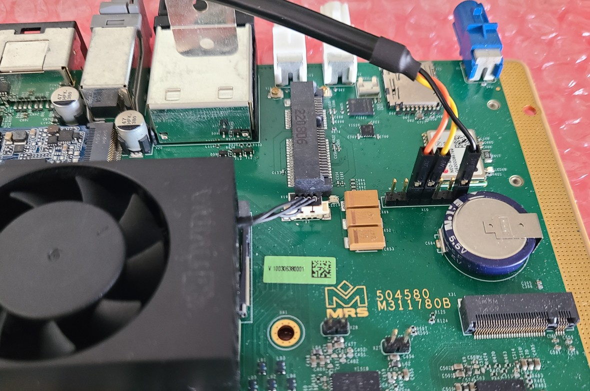

import { Aside, Steps } from '@astrojs/starlight/components';

### Serial Console (root access)
The serial console connector is located on the top side of the mainboard.  The connector pinout is as follows:

|  Pin  |  Name  |
| ----- | ------ |
| X10.1 | M4_RX  |
| X10.2 | M4_TX  |
| X10.3 | IMX_RX  |
| X10.4 | IMX_TX  |
| X10.5 | SCU_RX  |
| X10.6 | SCU_TX  |
| X10.7 | GND  |

Using your UART-to-USB adapter, you will need to connect the ground wire to pin X10.7, your RX to pin X10.4, and your TX to pin X10.3.  

